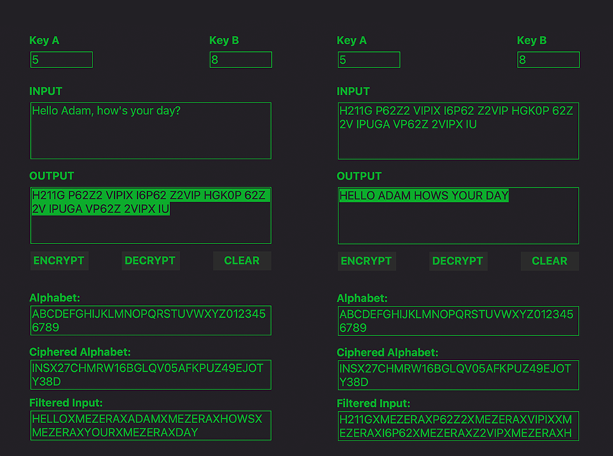

# Affine Cipher

A simple Python application for encrypting and decrypting text using the affine cipher algorithm.  
The project features an easy-to-use graphical user interface built with Tkinter




## Main Files

- **affine_cypher.py** — contains the affine cipher logic and helper functions
- **gui.py** — provides the graphical interface for user interaction
- **main.py** — allows you to launch the GUI by running `python main.py`

## How to Run
```bash
git clone https://github.com/adamstefanik/affine_cipher.git
cd affine_cipher
```
2. Start the main file
```
python main.py
```
3. (If you are on Linux and get an error about Tkinter, install it via  
`sudo apt install python3-tk`.)

## Structure
```
affine_cipher/
├── pycache/
├── assets/
│ └── ui_screenshot .png
├── gui.py
├── LICENSE
├── main.py
├── README.md
```

## Dependencies

- Python 3.8+
- Tkinter


## License

This project was developed as part of my studies in software engineering during my sophomore year at Univerzita Tomáše Bati v Zlíne and is intended for educational purposes.
